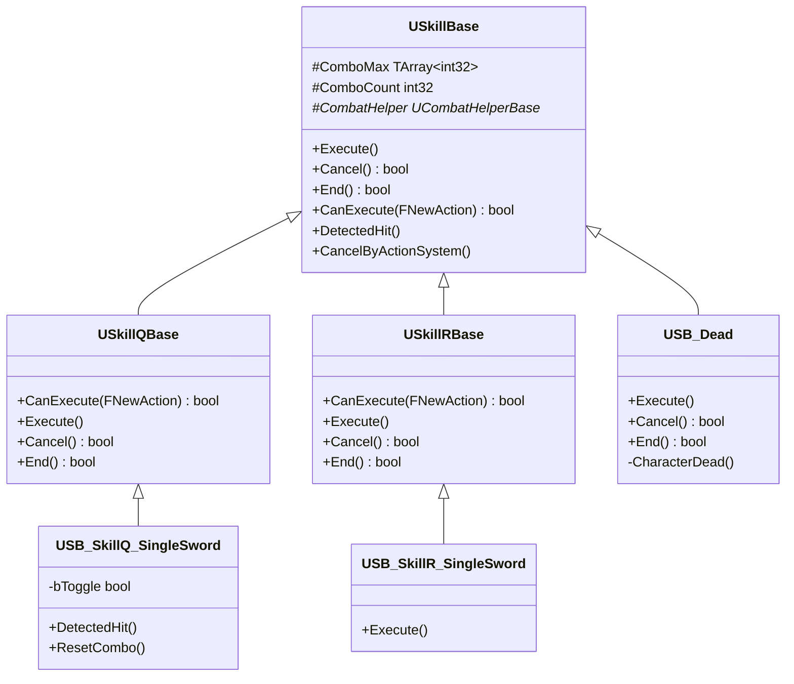

# SkillBase

> `CombatComponent` 위에서 동작하는 **Strategy 패턴 기반 스킬 계층**


---

## Architecture

### 스킬 교체와 스킬 추가 — CombatComponent

무기가 장착되면 `CombatComponent`가 두 가지를 처리합니다.

**① Helper 생성 — `SpawnCombatHelper()`**

무기 타입에 따라 `UCombatHelperBase` 서브클래스를 `NewObject`로 생성합니다. 이미 생성된 Helper가 있으면 재사용합니다.

**② 슬롯별 스킬 할당 — `SetSkillBase()`**

```cpp
// 이전 스킬 제거
if (USkillBase* OldSkill = SkillBases[ActionType])
{
    RemoveReplicatedSubObject(OldSkill);
    OldSkill->MarkAsGarbage();
}

// 새 스킬 생성 및 초기화
USkillBase* SkillBase = NewObject<USkillBase>(this, SkillData->SkillClass);
AddReplicatedSubObject(SkillBase);
SkillBase->Initialize(this, *SkillData, CombatHelperBase, ActionType);
SkillBases[ActionType] = SkillBase;
```

`SkillBases`는 `ENewActionType` 크기의 배열이므로 슬롯 인덱스로 O(1) 접근합니다. 새 무기 스킬 추가 시 `SkillData` 테이블에 항목을 추가하고 `USkillBase`를 상속한 클래스를 작성하면 됩니다. 기존 코드를 수정하지 않습니다.


---

### SkillBase 계층

```
USkillBase  (UObject + FTickableGameObject)
│  모든 스킬의 공통 인터페이스
│  Tick 관리, 몽타주 비동기 로딩, 콤보 타이머
│
├── USkillQBase
│   │  Q 슬롯 공통 행동 (CanExecute 쿨타임 검사, Execute 흐름)
│   │
│   └── USB_SkillQ_SingleSword
│          DetectedHit — 콤보 히트 판정
│          ResetCombo  — bToggle 기반 방향 전환
│
├── USkillRBase
│   │  R 슬롯 공통 행동
│   │
│   └── USB_SkillR_SingleSword
│          Execute — bEnhanced 활성화 후 투사체 발사
│
└── USB_Dead  (직접 상속)
       Execute — 사망 처리 시작
       CharacterDead() — 사망 로직 실행
```



---

## 주요 멤버 함수

| 함수 | 설명 |
|---|---|
| `Execute()` | 스킬 실행. 몽타주 재생, 상태 플래그 설정 |
| `CanExecute(FNewAction&)` | 쿨타임·상태 기반 실행 가능 여부 판단. `NewTryPlayAction_Internal`에서 호출 |
| `Cancel()` | 외부 요인(다른 스킬 입력 등)에 의한 중단 |
| `CancelByActionSystem()` | `ActionSystem`이 호출하는 강제 중단. **비가상 함수** — 중단 경로는 항상 동일하게 처리 |
| `End()` | 정상 종료. 몽타주 완료 또는 `LifeTime` 만료 시 호출 |
| `DetectedHit()` | 히트박스 감지 시 호출. 콤보 카운트 증가, 데미지 적용 |
| `Confirm()` | 2단계 스킬(조준 후 발사 등)의 확인 입력 처리 |
| `ResetCombo()` | 콤보 카운터 초기화. 서브클래스에서 무기별 추가 리셋 로직 구현 |
| `RequestPlayMontage()` | 서버에서 Multicast RPC로 몽타주 재생 요청 |

---

## CombatHelperBase

같은 무기의 SkillBase들(Q, E, R, Attack)은 서로를 직접 참조하지 않습니다. 대신 동일한 `CombatHelperBase` 인스턴스를 공유하며, 이 객체가 **상태 공유와 공통 기능의 중재자** 역할을 합니다.


### USingleSwordHelper

```cpp
class USingleSwordHelper : public UCombatHelperBase, public IShootProjectileInterface
{
    bool bEnhanced = false;          // R 스킬 발동 시 true, Q 스킬이 참조
    float EnhancedTime = 7.f;        // Enhanced 지속 시간

    void ShootProjectile();                      // 정면 투사체 발사
    void ShootProjectile_WithRoll(float Roll);   // Roll 각도만큼 회전한 방향으로 발사
};
```

`bEnhanced`는 SingleSword R 스킬이 발동되면 `true`로 설정하고, Q 스킬이 이를 읽어 공격 방식을 변경합니다. Helper 없이 이를 구현하려면 Q 스킬이 R 스킬을 직접 참조해야 하는 결합성이 생깁니다.
CombatHelperBase는 `ShootProjectile_WithRoll(float Roll)`과 같은 SkillBase에 직접 구현하기 모호하고, SkillBase가 공통으로 호출할 함수 구현 장소에 적합합니다.

---

## File Structure

```
SkillBase/
├── SkillBase.h/.cpp                  스킬 공통 인터페이스, Tick 관리, 몽타주 로딩, 콤보 타이머
├── CombatHelperBase.h/.cpp           SkillBase 간 상태·기능 공유 중재자
├── SkillQBase.h/.cpp                 Q 슬롯 공통 행동
├── SB_SkillQ_SingleSword.h/.cpp      단검 Q 스킬 (bToggle 콤보, DetectedHit)
├── SkillRBase.h/.cpp                 R 슬롯 공통 행동
├── SB_SkillR_SingleSword.h/.cpp      단검 R 스킬 (bEnhanced 활성화, 투사체 발사)
└── SingleSwordHelper.h/.cpp          단검 Helper (bEnhanced 공유, ShootProjectile)
```
