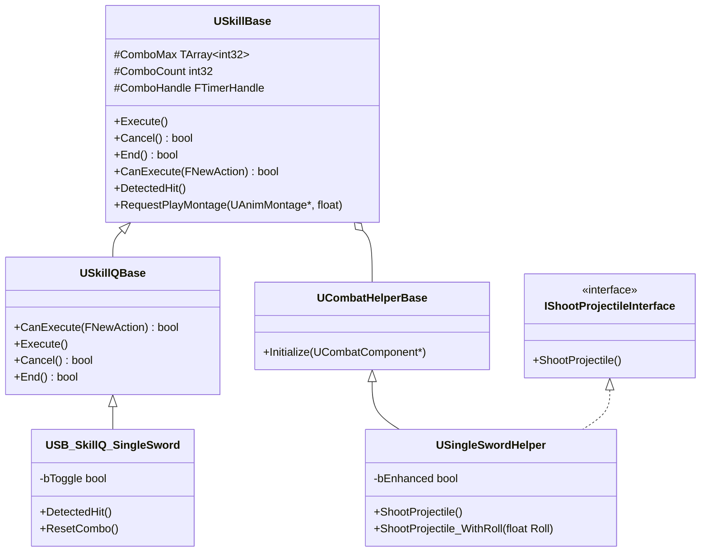

# SkillBase

> `CombatComponent`의 행동 시스템 위에서 동작하는 **Strategy 패턴 기반 스킬 계층**

---

## Overview

스킬은 `USkillBase`를 최상위로 하는 상속 계층으로 구성됩니다. 각 레이어는 슬롯 공통 행동을 구현하고, 구체 클래스는 무기별 고유 동작만 오버라이드합니다.

무기별 투사체 발사 같은 물리적 로직은 `UCombatHelperBase` 계층으로 분리되어, 스킬 클래스가 무기 종류를 직접 알지 않아도 됩니다.

---

## Architecture

### 스킬 계층

```
USkillBase (FTickableGameObject)
│  Execute / Cancel / End / CanExecute / DetectedHit
│  RequestPlayMontage, 콤보 타이머, 몽타주 비동기 로딩
│
└── USkillQBase
    │  Q 슬롯 공통 행동 (CanExecute 쿨타임 검사, Execute 흐름)
    │
    └── USB_SkillQ_SingleSword
           DetectedHit 오버라이드 — 콤보 히트 판정
           ResetCombo 오버라이드  — bToggle 기반 방향 전환
```

### 클래스 다이어그램



### CombatHelper 분리 이유

스킬 클래스가 투사체 발사, 이펙트 재생 같은 무기 고유 동작을 직접 구현하면, 같은 Q 슬롯 스킬이라도 무기마다 `Execute()` 구현이 달라집니다. 무기가 추가될 때마다 스킬 클래스도 수정해야 합니다.

`UCombatHelperBase`를 분리하면 스킬 클래스는 "Q 스킬 흐름"만, Helper는 "이 무기로 어떻게 쏘는가"만 담당합니다. `CombatComponent`는 인터페이스를 통해 발사를 요청하므로 무기 종류를 알 필요가 없습니다.

```cpp
// CombatComponent::ShootProjectile()
// 스킬과 컴포넌트 모두 무기 구체 클래스를 알지 않아도 됩니다.
if (CombatHelper->GetClass()->ImplementsInterface(UShootProjectileInterface::StaticClass()))
{
    Cast<IShootProjectileInterface>(CombatHelper)->ShootProjectile();
}
```

`USingleSwordHelper`는 `ShootProjectile_WithRoll(float Roll)`을 추가로 제공합니다. Roll 각도를 받아 발사 방향을 틀어주는 함수로, SingleSword R 스킬의 다방향 투사체를 구현합니다.

### 새 무기 스킬 추가 시

1. `UCombatHelperBase`를 상속받은 `UXxxHelper` 생성 — 무기 고유 발사·이펙트 로직
2. `USkillQBase`를 상속받은 `USB_SkillQ_Xxx` 생성 — Q 스킬 흐름 오버라이드
3. `CombatComponent::SpawnCombatHelper`에 무기 타입 케이스 추가

기존 클래스를 수정하지 않습니다.

---

## File Structure

```
SkillBase/
├── SkillBase.h/.cpp                   스킬 베이스, Tick 관리, 몽타주 로딩, 콤보 타이머
├── CombatHelperBase.h/.cpp            Helper 베이스, Initialize
├── SkillQBase.h/.cpp                  Q 슬롯 공통 행동
├── SB_SkillQ_SingleSword.h/.cpp       단검 Q 스킬 구현체 (bToggle 콤보, DetectedHit)
└── SingleSwordHelper.h/.cpp           단검 Helper (ShootProjectile, ShootProjectile_WithRoll)
```
